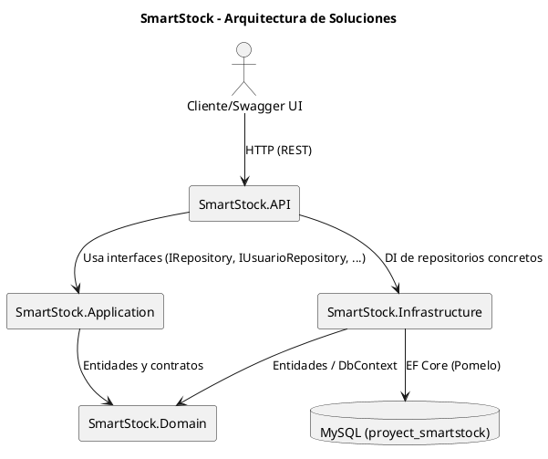

# SmartStock Backend

Guía para inicializar y ejecutar el backend de SmartStock con MySQL en Docker y la API .NET con Swagger.

**Proyectos**
- `SmartStock.Domain`: Entidades de dominio, sin dependencias.
- `SmartStock.Application`: Interfaces de repositorio y contratos de aplicación.
- `SmartStock.Infrastructure`: EF Core (Pomelo), `SmartStockDbContext`, repositorios concretos.
- `SmartStock.API`: API REST (Swagger, Controllers, DTOs).

## Prerrequisitos
- Docker Desktop (Windows/Mac/Linux)
- .NET SDK 9.0 (`dotnet --version`)
- PowerShell, VS Code o Visual Studio (opcional)

## Inicialización de Base de Datos (Docker)
1. En la raíz del repo, levanta MySQL con datos de inicialización:
   - `docker compose up -d`
2. Verifica estado del contenedor:
   - `docker ps` (debe mostrar `smartstock-mysql` como `Up (healthy)`)
3. (Opcional) Verifica el seed:
   - `docker logs smartstock-seed`
   - Si ya hay usuarios: "Datos ya presentes". Si no, se ejecuta `02-datos.sql`.

Base de datos:
- Host: `localhost`, Puerto: `4000`
- DB: `proyect_smartstock`
- Usuario: `root`, Password: `secret`

## Configuración de la API
- Archivo: `SmartStock.API/appsettings.json`
- ConnectionString usada por la API:
  - `DefaultConnection`: `Server=localhost;Port=4000;Database=proyect_smartstock;User=root;Password=secret;`
- Proveedor EF Core: Pomelo MySQL con autodetección de versión.

## Ejecutar la API
1. Compila la solución:
   - `cd SmartStock.API`
   - `dotnet build`
2. Ejecuta la API:
   - `dotnet run`
3. Verifica en consola:
   - `Now listening on: http://localhost:5085`
4. Abre Swagger:
   - `http://localhost:5085/swagger`

## Endpoints principales
- `GET /api/usuarios`
- `GET /api/categorias`, `POST/PUT/DELETE /api/categorias/{id}`
- `GET /api/productos`, `POST/PUT/DELETE /api/productos/{id}`
- `GET /api/proveedores`, `GET /api/proveedores/usuario/{usuarioId}`, `POST/PUT/DELETE /api/proveedores/{id}`

## Comandos útiles
- Reiniciar base: `docker compose down && docker compose up -d`
- Ver logs MySQL: `docker logs smartstock-mysql`
- Inspección contenedores: `docker ps`

## Solución de problemas
- Error 500 en API:
  - Verifica que MySQL esté healthy (`docker ps`) y la cadena en `appsettings.json`.
- DLL bloqueadas al compilar:
  - Cierra procesos previos de `dotnet run` o mata el PID con PowerShell (`Stop-Process -Id <PID> -Force`).
- Puerto 4000 en uso:
  - Cambia el mapeo en `docker-compose.yml` y ajusta `appsettings.json`.

## Diagrama de Arquitectura (PlantUML)
Archivo: `docs/smartstock-architecture.puml`.

Código PlantUML (puedes renderizarlo con plugin de VS Code o en https://www.plantuml.com/plantuml):

